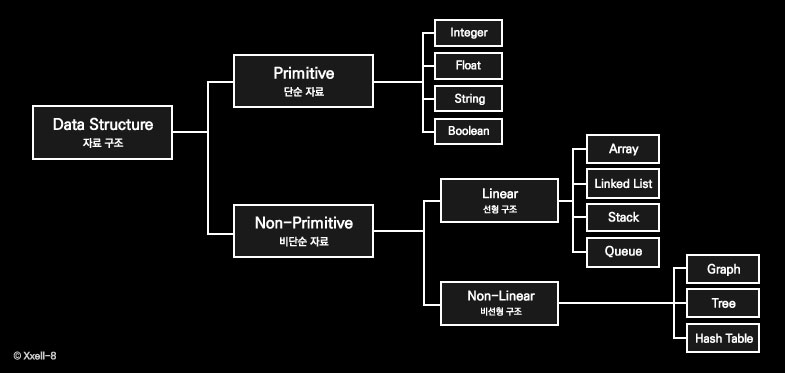

# Data Structure 📂

> - 자료구조란, 데이터에 편리하게 접근하고 변경하기 위해 데이터를 저장하거나 조작하는 방법으로 볼 수 있습니다.
>
>   

## 1. Array

#### 🚩 What?

- `Array`는 **index와 index에 대응하는 데이터**들로 이루어진 자료 구조입니다.
  - 데이터를 순차적으로 저장하는 순서가 있는 객체(Sequence)이며,
  - index를 통해 `O(1)`의 시간 복잡도로 해당 원소에 접근이 가능합니다.
    - 즉, random access가 가능한 자료 구조입니다.

- 배열에서 원소를 `삽입`하거나 `삭제`할 경우, 최대 `O(n)`의 시간 복잡도가 발생합니다.
  - 이는 삽입·삭제를 수행한 후, 배열 내 원소의 순서를 맞추기 위해 다른 원소들의 index를 조정하는 추가 작업이 필요하기 때문입니다.
    - 원소를 삭제할 경우, 해당 index에 빈 공간이 발생하기 때문에 삭제한 원소 이후에 있는 원소들을 -1씩 shift해줘야 합니다.
    - 마찬가지로, 원소를 삽입할 경우 해당 자리 이후에 위치한 원소들을 1씩 shift하여 올바른 index로 조정하는 과정이 필요합니다.
    - 때문에, 삽입과 삭제에서는 다른 자료구조보다 속도가 느릴 수 있습니다.

##### 📌 List in Python

- Python에서는 Array와 비슷한 특성을 가진 `List`를 사용합니다.

  - `List`는 동적 배열로 작성된 순차 리스트이며,

    - 크기와 원소의 데이터 타입에 제한이 없다는 점에서 Array와의 차이를 보입니다.

      |       | 크기      | 원소의 데이터 타입              |
      | ----- | --------- | ------------------------------- |
      | Array | 변경 불가 | 선언된 한 가지 타입만 저장 가능 |
      | List  | 변경 가능 | 다양한 데이터 타입 저장 가능    |

## 2. Linked List

#### 🚩 What?

- `Linked List`는 자료의 **논리적 순서**와 메모리 상의 **물리적 순서**가 **일치하지 않고**, 개별적으로 위치하고 있는 **원소의 주소를 연결**하여 하나의 전체적인 자료구조를 이룹니다.

  - 각각의 노드는 데이터 필드와 링크 필드로 구성되며, 

    - 데이터 필드는 원소의 데이터 값을, 링크 필드는 다음 노드의 주소를 저장합니다.

  - 링크를 통해 원소에 접근하여 삽입과 삭제 시 물리적 순서를 맞추기 위한 작업이 필요하지 않습니다.

    - 그러나, 순차 탐색을 통해 원소에 접근하기 때문에 원하는 위치나 원소를 찾는 과정에서 `O(n)`의 시간이 걸립니다.

    

📌 **Double Linked List**

- 단순 연결 리스트의 경우, 링크를 통해 탐색하는 과정에서 선행 노드로 돌아가는 것이 불가능합니다. 원하는 노드를 지나쳤다면, 처음부터 다시 링크를 따라 이동해야 하는데, 이를 보완하기 위한 방법으로 이중 연결 리스트가 있습니다.
  - 양쪽 방향으로 순회할 수 있도록 노드를 연결한 리스트로, 
  - 데이터 필드와 두 개의 링크 필드(이전 노드와 다음 노드 주소 저장)로 구성됩니다.

## 3. Stack

#### 🚩 What?

- `Stack`은 후입선출(`LIFO, Last-In First-Out`) 형식의 선형 자료 구조입니다.
  - 데이터가 차곡차곡 쌓이는 구조로, 시간 순서에 따라 자료가 쌓여 가장 마지막에 삽입된 자료가 가장 먼저 삭제된다는 특징을 가집니다.

- Stack은 `top`을 통해 삽입(`push`)과 삭제(`pop`) 연산을  수행하며, 
  - 가장 마지막에 삽입한 원소가 `top`에 위치합니다.

#### 🚩 Why?

- LIFO의 특성을 가진 Stack은, 최근 기록을 우선적으로 반환하기 때문에 다양한 분야에서 활용될 수 있습니다.

  - 재귀 알고리즘

  - 콜 스택 메모리

  - 브라우저 방문 기록(뒤로가기)

  - 실행 취소(undo)

    

## 4. Queue

#### 🚩 What?

- `Queue`는 선입선출(`FIFO, First-In First-Out`) 형식의 선형 자료 구조입니다.
  - Stack과는 반대로, 먼저 들어간 원소가 앞에서 대기하다가 먼저 나오는 구조입니다.

- Queue는 `front`와 `rear`에서 각각 삭제와 삽입 연산을 수행하며,
  - 가장 먼저 들어온 원소를 front, 가장 마지막에 삽입된 원소를 rear로 설정합니다.

#### 🚩 Why?

- FIFO의 특성을 가진 Queue는, 주로 데이터의 입력 순서에 따라 처리해야 하는 상황에서 유용하게 활용됩니다.
  - 우선순위가 같은 작업 예약 (ex. 인쇄 대기열)
  - 프로세스 관리
  - 캐시(Cache) 구현
  - 버퍼 (데이터를 전송하는 동안 일시적으로 그 데이터를 보관하는 메모리 영역)

