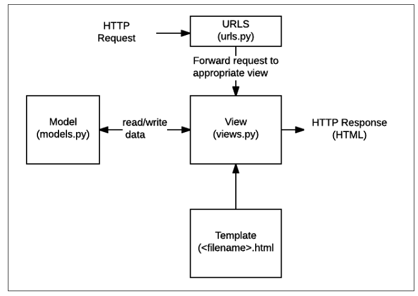

# 01. INTRO


## 1. Django 기본

####  1. Start Project & APP

- project 생성 시, Python이나 Django에서 사용 중인 이름은 피하고, `-`도 사용 금지

- git bash 명령어

  ```bash
  #프로젝트 생성
  $ django-admin startproject 프로젝트 이름
  
  #서버 생성 확인(manage.py 와 같은 폴더에서 사용)
  $ python manage.py runserver
  
  #(서버 끄고) 앱 생성
  $ python manage.py startapp 앱 이름
  ```


####  2. Project Structure

- `__init__.py`
  - 빈 파일
  - Python에게 이 디렉토리를 하나의 Python 패키지로 다루도록 지시
- `settings.py`
  - 웹사이트의 모든 설정을 포함
  - 우리가 만드는 어떤 application이라도 등록이 되는 곳이며, static files의 위치, database 세부 설정 등이 작성
- `urls.py`
  - 사이트의 url와 view의 연결을 지정
- `wsgi.py`
  - Web Server Gateway Interface
  - 장고 어플리케이션이 웹서버와 연결 및 소통하는 것을 도움
- `asgi.py`
  - new in 3.0
  - Asynchronous Server Gateway Interface
  - 장고 어플리케이션이 비동기식 웹 서버와 연결 및 소통하는 것을 도움


####  3. APP Structure

- `admin.py`

  - 관리자용 페이지 관련 기능 작성

- `apps.py`

  - 앱의 정보

    cf. 수정 X

- `models.py`

  - 앱에서 사용하는 Model(Database)를 정의

- `tests.py`

  - 테스트 코드를 작성

- `views.py`

  - view 함수 정의
  - 중간 관리자로 볼 수 있음 


####  4. APP 등록

- 반드시 **APP 생성 후 등록** 순서를 지켜야 함

- APP 이름은 **복수형** 사용

- 생성한 APP을 사용하기 위해 프로젝트로 APP 등록

  ```python
  # settings.py
  INSTALLED_APPS = [
  	'articles', 👉 앱 등록
      'django.contrib.admin',
      'django.contrib.auth',
      'django.contrib.contenttypes',
      'django.contrib.sessions',
      'django.contrib.messages',
      'django.contrib.staticfiles',
  ]
  ```

  > cf. INSTALLED_APPS 작성 순서
  >
  > ```python
  > INSTALLED_APPS = [
  >  # 1. Local apps
  >  'articles',
  >     
  >  # 2. Third party apps 
  >  'bootstrap5',
  > 
  >  # 3. Django apps
  >  'django.contrib.admin',
  >  ...,
  > ]
  > ```
  >
  > cf. 원래 `articles.apps.ArticlesConfig` 으로 등록해야 하지만, shorthand로 `articles`만 써도 등록이 된다.


####  5. etc

- 한국어 / 서울 기준 시간으로 설정 변경하기

  ```python
  # settings.py
  # Internationalization
  LANGUAGE_CODE = 'ko-kr'
  TIME_ZONE = 'Asia/Seoul'
  ```

- 기본 `import` 순서

  - 표준 라이브러리
  - 외부 라이브러리
  - 장고 라이브러리
  - 로컬 파일


## 2. MTV 패턴



- MTV 패턴

  | MTV(Django) | 역할           | MVC        |
  | ----------- | -------------- | ---------- |
  | Model       | DB 관리        | Model      |
  | Template    | 레이아웃(화면) | View       |
  | View        | 중간 컨트롤러  | Controller |

  - Model
    - 응용프로그램의 데이터 구조를 정의
    - 데이터베이스 기록 관리(추가, 수정, 삭제)
  - Template
    - 파일의 구조나 레이아웃 정의
    - 실제 내용 표시 (HTML 파일)
  - View
    - HTTP 요청을 수신 + HTTP 응답 반환
    - Model을 통해 요청에 필요한 데이터에 접근
    - Template에 응답 서식 설정을 맡김


- 자주 사용하는 파일
  - `urls.py`: 주소(URL) 관리
  - `views.py`: 페이지 관리
  - `templates/OO.html`: 페이지 레이아웃 관리
  - `models.py`: 데이터 베이스 관리


## 3. request

- `urls.py`

  - 서버로 요청(request)이 들어오면, 그 요청이 어디로 가야하는지 인식하고 관련된 함수(view)로 연결

  - `views.py` 에서 만든 함수를 연결

    ```python
    # project 이름/urls.py
    
    from django.contrib import admin
    from django.urls import path
    from 앱 이름 import views
    
    urlpatterns = [
        path('admin/', admin.site.urls),
        path('index/', views.index),
    ]
    ```


- `views.py`

  - HTTP 요청을 수신하고 HTTP 응답을 반환하는 함수 작성
  - Model을 통해 요청에 맞는 필요 데이터에 접근
  - tempate에게 HTTP 응답 서식을 맡김

  ```python
  # articles/views.py
  
  # 첫번째 인자는 반드시 request
  def index(request):
      # render의 첫번째 인자도 반드시 request
      return render(request, 'index.html') 
  ```


- `templates`

  - `views.py`에서 지정한 `html` 파일을 담는 폴더
  - Django에서 template이라고 부르는 HTML 파일은 기본적으로 **app 폴더안의 templates 폴더 안에 위치**한다. 

  ```html
  <!-- articles/templates/index.html -->
  
  <h1>Title</h1>
  ```

  

## 4. Templates

- 데이터 표현을 제어하는 도구이자 표현에 관련된 로직
- DTL (Django Template Language)
  - Django HTML에서 사용하는 built-in template system
  - 조건, 반복, 변수 치환, 필터 등의 기능 제공
    - 단순히 Python이 HTML에 포함된 것이 아니며, 프로그래밍적 로직이 아니라 프레젠테이션을 표현하기 위한 것
    - 파이썬처럼 if, for를 사용할 수 있지만, 해당 python 코드로 실행되는 것은 아님

- DTL Syntex

  - Variables (변수)
    - `{{ variable }}`
    - 변수명은 영문, 숫자, `_` 로 구성 가능
    - `.`(dot)를 통해 변수 속성에 접근
    - view 함수에서 `context`(dict)에 담아 template에 넘기고, key 값으로 접근

  

  - Filters (필터)
    - `{{ variable|filter }}`

    - 표시할 변수를 수정할 때 사용

      ex. `{{ name|lower }}` 👉 name 변수를 모두 소문자로 출력

    - `|`(파이프)를 사용하여 적용

      - 60개의 built-in template filters  제공

    - 나열이 가능하고, 인자를 받기도 함
      
      - `{{ variable|truncatewords:30 }}`

  

  - Tags (태그)
    - ``
    - 출력 텍스트를 만들거나, 반복 또는 논리를 수행하여 제어 흐름을 만드는 등 변수보다 복잡한 일들을 수행
    - 일부 태그는 시작/종료 태그 필요
      - `` ... ``
    - 약 24개의 built-in template tags 제공

  

  - Comments (주석)
    - `{# lorem ipsum #}`
    - `` ... ``


#### + Template Inheritance

- 템플릿 상속은 기본적으로 코드의 재사용성에 초점

- 템플릿 상속을 사용하면 사이트의 모든 공통 요소를 포함

  - 하위 템플릿이 재정의할 수 있는 블록을 정의하는 기본 `skeleton` 템플릿을 만들 수 있음

- 기본적으로, PROJECT 폴더 내에 templates 폴더를 생성해 사용

  ```python
  # settings.py에 경로 추가
  
  TEMPLATES = [
      {
          ...,
          'DIRS': [BASE_DIR / 'firstpjt' / 'templates'],
  		...,
      }
  ]
  ```

  

- 기본 `tags`

  - `extends`
    - 자식(하위)템플릿이 부모 템플릿을 확장한다는 것을 알림
    - **반드시 템플릿 최상단**에 위치
      - 즉, 2개 이상 사용할 수 없음
  - `block`
    - 하위 템플릿에서 재지정(overriden)할 수 있는 블록을 정의
    - 하위 템플릿이 채울 수 있는 공간

    - 가독성을 높이기 위해 선택적으로 `` 태그에 이름 지정

#### + Django template system (django 설계 철학)

- **표현과 로직(view)을 분리**
  - 템플릿 시스템은 **표현을 제어하는 도구**이자 표현에 관련된 로직일 뿐!
  - 즉, 템플릿 시스템은 이러한 기본 목표를 넘어서는 기능을 지원하지 말아야 한다.

- **중복을 배제**
  - 대다수의 동적 웹사이트는 공통 header, footer, navbar 같은 사이트 공통 디자인을 가지는데,
    - Django 템플릿 시스템은 이러한 요소를 한 곳에 저장하기 쉽게 하여 **중복 코드를 제거**


## 5. HTML form

####  1. HTML form element

- 웹에서 사용자 정보를 입력하는 여러 방식(text, buttom, checkbox, file, hidden, image, password, radio, reset, submit 등)을 제공하고, 사용자로부터 할당된 데이터를 서버로 전송하는 역할을 담당
- 핵심 속성
  - `action`: 입력 데이터가 전송될 URL 지정
  - `method`: 입력 데이터 전달 방식 지정


####  2. HTML input element

- 사용자로부터 데이터를 입력받기 위해 사용
- `type` 속성에 따라 동작 방식이 달라짐
- 핵심 속성
  - `name`
  - 중복 가능, 양식을 제출했을 때 name이라는 이름에 설정된 값을 넘겨서 값을 가져올 수 있음
  - 주요 용도는 GET/POST 방식으로 서버에 전달하는 파라미터(name은 key, value 는 value)로 `?key=value&key=value` 형태로 전달


####  3. HTTP request methods

- **HTTP**
  - Hyper Text Transfer Protocol (Seaure)
  - 웹에서 이루어지는 모든 데이터 교환의 기초
  - 주어진 리소스가 수행할 원하는 작업을 나타내는 request methods 정의
    - HTTP request method: GET, POST, PUT, DELETE ...

- **GET**
  - 서버로부터 정보를 **조회**하는데 사용
  - 데이터를 가져올 때만 사용해야 함
  - 데이터를 서버로 전송할 때 body가 아닌 **Query String Parameters**를 통해 전송
  - 즉, 클라이언트가 서버에 요청을 보내 HTML 문서 파일 한 장을 받는데, 이때 사용하는 요청 방식이 **GET**

- THROW - CATCH

  - THROW

    ```python
    # project/urls.py
    urlpatterns = [
        ...,
        path('throw/', views.throw),
    ]
    
    # app/views.py
    def throw(request):
        return render(request, 'throw.html')
    ```

    ```django
    {# app/templates/throw.html #}
    
    <form action="/catch/" method="GET">
      <label for="message">Throw</label>
      <input type="text" id="message" name="message">
      <input type="submit">
    </form>
    ```

  - CATCH

    ```python
    # project/urls.py
    urlpatterns = [
        ...,
        path('catch/', views.catch),
    ]
    
    # app/views.py
    def catch(request):
        message = request.GET.get('message')
        context = {
            'message': message,
        }
        return render(request, 'catch.html', context)
    ```

    ```django
    {# app/templates/catch.html #}
    
    <h1>We got "{{ message }}" from THROW!</h1>
    <a href="/throw/">BACK</a>
    ```


- **Request Object**

  - 요청 간의 모든 정보를 담고 있는 변수

  - 페이지가 요청되면 Django는 요청에 대한 메타 데이터를 포함하는 `HttpRequest` 객체 생성

    👉 view 함수에 `HttpRequest`를 첫 번째 인자로 전달

    ​	👉 view 함수는 `HttpRequest` 객체를 반환


## 6. URLs

> - Dispatcher(발송자, 운항 관리자)로서의 URL
> - 웹 어플리케이션은 URL을 통한 클라이언트의 요청에서부터 시작


####  1. Variable Routing

- 동적 라우팅이란, 주소 자체를 변수처럼 사용해 동적으로 주소를 만드는 것

  ```python
  # urls.py
  
  urlpatterns = [
      ...,
      path('hello/<str:name>/', views.hello),
      # shorthand 👉 path('hello/<name>/', views.hello),
  ]
  ```

  - cf. `str`은 생략이 가능하나, `int`는 생략하면 안됨!

  ```python
  # views.py
  def hello(request, name):
      context = {
          'name': name,
      }
      return render(request, 'hello.html', context)
  ```

  ```django
  {# hello.html #}
  
  
  
  
    <h1>Hello, {{ name }}!</h1>
  
  ```

  

####  2. App URL mapping

- 하나의 PROJECT에 여러 APP이 존재한다면,

  - 각각의 APP 안에 urls.py를 생성하고

  - PROJECT/urls.py에서 각 APP/urls.py로 URL 매핑을 위탁

    👉 코드의 유지 보수 간편화


####  3. Including other URLconfs

- `include()` 함수를 활용해 다른 URLconf를 참조할 수 있도록 도움

  -  `include()`를 만나면, URL의 그 시점까지 일치하는 부분을 자르고, 
  - 남은 문자열 후속 처리를 위해 include 된 URLconf로 전달

  ```python
  # pjt/urls.py
  
  from django.contrib import admin
  from django.urls import path, include
  
  
  urlpatterns = [
      path('admin/', admin.site.urls),
      path('articles/', include('articles.urls')),
      path('pages/', include('pages.urls')),
  ]
  ```

  

####  4. Naming URL patterns

- Django는 URL에 이름을 지정하는 방법을 제공하므로써 view 함수와 template에서 특정 주소를 쉽게 참조할 수 있도록 도움
  - `path()` 함수의 name 인자를 정의해 사용
  - url 설정에 정의된 특정 경로들의 의존성을 제거
- ``
  - 주어진 URL 패턴 이름 및 선택적 매개 변수와 일치하는 절대 경로 주소를 반환
  - 템플릿에 URL을 하드 코딩하지 않고도 DRY 원칙을 위반하지 않고 링크를 출력하는 방법


## 7. Name space

> 개체를 구분할 수 있는 범위를 나타내는 namespace

- django에서는
  - 서로 다른 app의 같은 이름을 가진 url name은 이름공간을 설정해서 구분
  - templates, static 등 django는 정해진 경로 하나로 모아서 보기 때문에 중간에 폴더를 임의로 만들어 줌으로써 이름 공간을 설정


####  1. URL namespace

- 각 APP의 urls.py에 **`app_name` attribute 작성**

  - URL namespace를 사용하면 서로 다른 앱에서 동일한 URL 이름을 사용하는 경우에도 고유한 URL 사용 가능

  ```python
  # articles/urls.py
  app_name = 'articles'
  urlpatterns = [
      path('index/', views.index, name='index'),
  ]
  
  # pages/urls.py
  app_name = 'pages'
  urlpatterns = [
      path('index/', views.index, name='index'),
  ]
  ```

  - 주소 참조

    - `:` 연산자를 사용해 지정 가능

    ```django
    {# articles/templates/index.html #}
    
    
    
    
      <h1>만나서 반가워요!</h1>
      <a href="">greeting</a>
      <a href="">dinner</a>
      <a href="">throw</a>
    
      <h2><a href="">pages HOME</a></h2>
    
    ```

    

####  2. Template namespace

- Django는 기본적으로 `app_name/templates/` 경로에 있는 templates 파일들만 찾을 수 있으며, INSTALLED_APPS에 작성한 app 순서로 tamplate을 검색 후 렌더링

- 임의로 templates의 폴더 구조를 `app_name/templates/app_name` 형태로 변경해 임의로 이름 공간 생성 후 변경된 추가 경로 작성

  ```python
  # articles/views.py
  return render(request, 'articles/index.html')
  
  # pages/views.py
  return render(request, 'pages/index.html')
  ```

  


